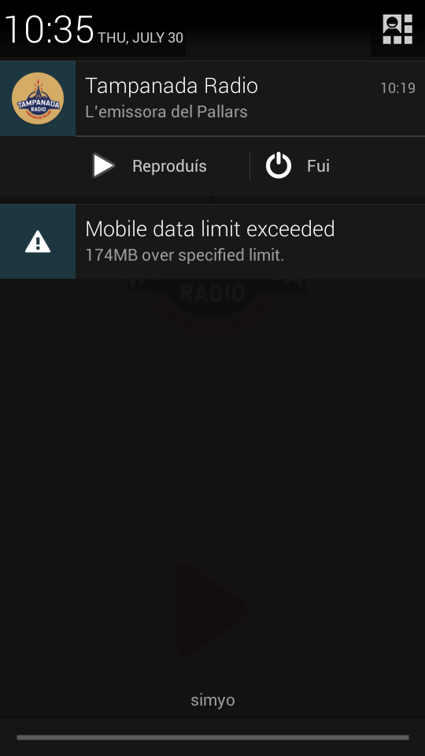

# Tampanada Radio

Welcome to Tampanada Radio, l'emissora del Pallars!
This is the Android application for [Tampanada Radio project](http://tampanadaradio.com).
It's a simple streaming player that works with a foreground service.
Feel free to use the code for your own music streaming player!

# Documentation

## Main Activity

Main activity simply shows the logo with a link to the website and
a play/pause button to control the foreground service that plays the radio.
Using a broadcast receiver, this activity is aware of the player state
in order to show the appropriate button.

## Foreground Service

The core of the application.
It's a service that plays an streaming url using the [ExoPlayer](https://github.com/google/ExoPlayer).
It also shows a non-removable notification to the user with a little menu with play/pause and stop options.
Finally, this piece also broadcasts messages to notify the activity about the player state.

## Retry Policy

The last part is the Retry Policy, that is customized and injected to the ExoPlayer
to force the player to retry when network connectivity problems arise exceptions.
